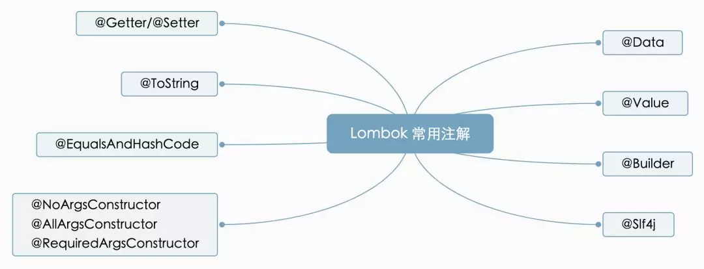
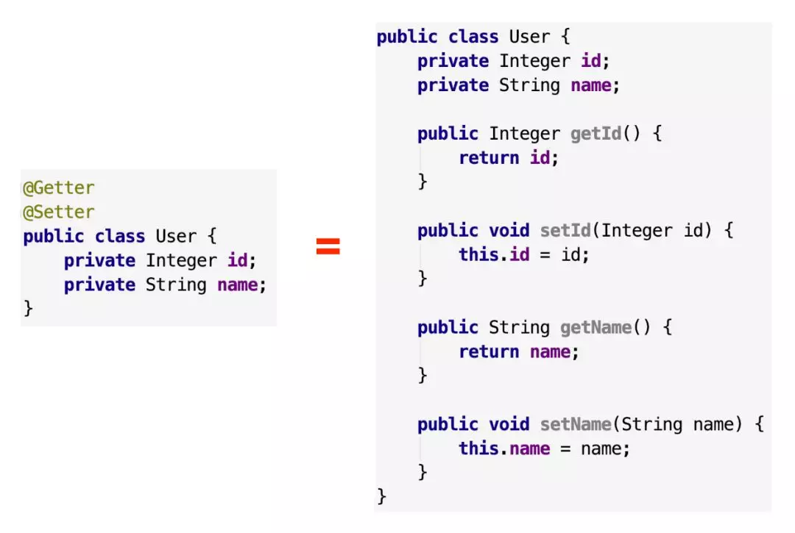
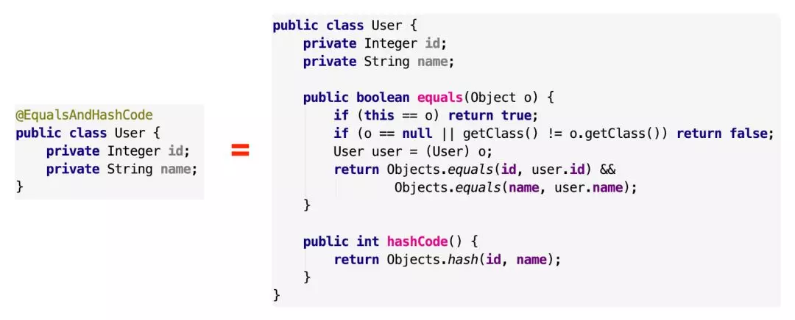
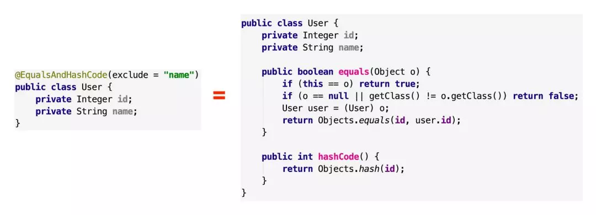
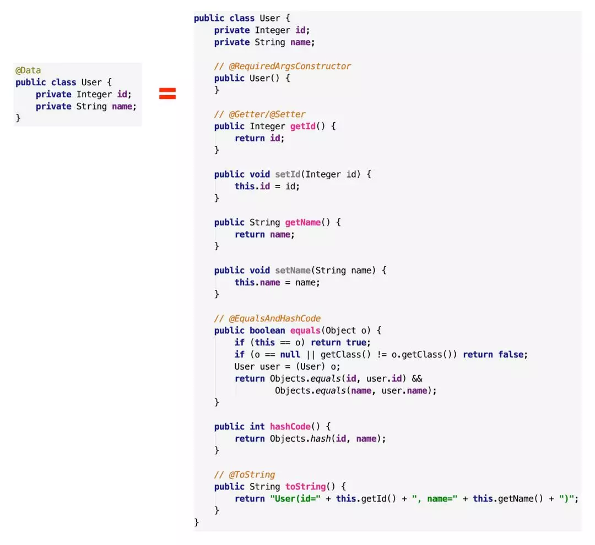
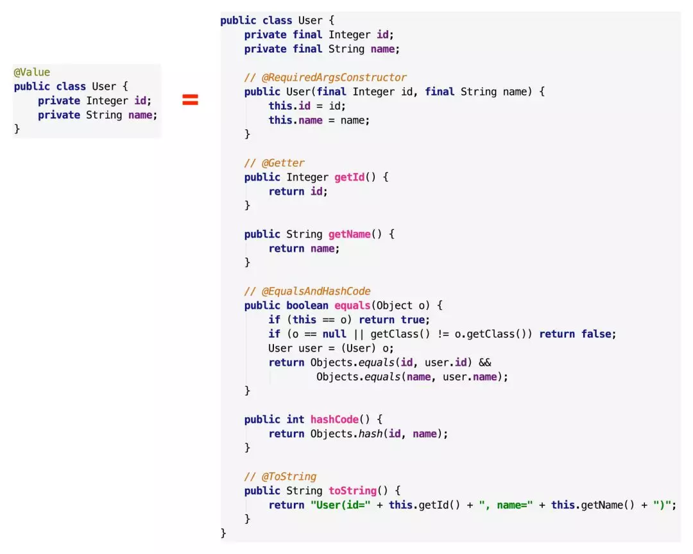

#### **加入 maven 依赖**

```
<dependency>
    <groupId>org.projectlombok</groupId>
    <artifactId>lombok</artifactId>
    <version>1.18.12</version>
</dependency>
```

 



 

 

 

#### 1. @Getter/@Setter

自动产生 getter/setter



 

#### 2. @ToString

自动重写 `toString()` 方法，会印出所有变量


 

#### 3. @EqualsAndHashCode

自动生成 `equals(Object other)` 和 `hashcode()` 方法，包括所有非静态变量和非 transient 的变量



 如果某些变量不想要加进判断，可以透过 exclude 排除，也可以使用 of 指定某些字段



Q : 为什么只有一个整体的 `@EqualsAndHashCode` 注解，而不是分开的两个 `@Equals` 和 `@HashCode`？

A : 在 Java 中有规定，当两个对象 equals 时，他们的 hashcode 一定要相同，反之，当 hashcode 相同时，对象不一定 equals。所以 equals 和 hashcode 要一起实现，免得发生违反 Java 规定的情形发生

####  

#### 4. @NoArgsConstructor, @AllArgsConstructor, @RequiredArgsConstructor

这三个很像，都是在自动生成该类的构造器，差别只在生成的构造器的参数不一样而已

**@NoArgsConstructor** : 生成一个没有参数的构造器


 **@AllArgsConstructor** : 生成一个包含所有参数的构造器


这里注意一个 Java 的小坑，当我们没有指定构造器时，Java 编译器会帮我们自动生成一个没有任何参数的构造器给该类，但是如果我们自己写了构造器之后，Java 就不会自动帮我们补上那个无参数的构造器了

然而很多地方（像是 Spring Data JPA），会需要每个类都一定要有一个无参数的构造器，所以你在加上 `@AllArgsConstructor` 时，一定要补上 `@NoArgsConstrcutor`，不然会有各种坑等着你

**@RequiredArgsConstructor** : 生成一个包含 "特定参数" 的构造器，特定参数指的是那些有加上 final 修饰词的变量们


补充一下，如果所有的变量都是正常的，都没有用 final 修饰的话，那就会生成一个没有参数的构造器

####  

#### 5. @Data

整合包，只要加了 @Data 这个注解，等于同时加了以下注解

- @Getter/@Setter
- @ToString
- @EqualsAndHashCode
- @RequiredArgsConstructor



@Data 是使用频率最高的 lombok 注解，通常 @Data 会加在一个值可以被更新的对象上，像是日常使用的 DTO 们、或是 JPA 裡的 Entity 们，就很适合加上 @Data 注解，也就是 @Data for mutable class

####  

#### 6. @Value

也是整合包，但是他会把所有的变量都设成 final 的，其他的就跟 @Data 一样，等于同时加了以下注解

- @Getter (注意没有setter)
- @ToString
- @EqualsAndHashCode
- @RequiredArgsConstructor



上面那个 @Data 适合用在 POJO 或 DTO 上，而这个 @Value 注解，则是适合加在值不希望被改变的类上，像是某个类的值当创建后就不希望被更改，只希望我们读它而已，就适合加上 @Value 注解，也就是 @Value for immutable class

另外注意一下，此 lombok 的注解 @Value 和另一个 Spring 的注解 @Value 撞名，在 import 时不要 import 错了

####  

#### 7. @Builder

自动生成流式 set 值写法，从此之后再也不用写一堆 setter 了


注意，虽然只要加上 @Builder 注解，我们就能够用流式写法快速设定对象的值，但是 setter 还是必须要写不能省略的，因为 Spring 或是其他框架有很多地方都会用到对象的 getter/setter 对他们取值/赋值

所以通常是 @Data 和 @Builder 会一起用在同个类上，既方便我们流式写代码，也方便框架做事

####  

#### 8. @Slf4j

自动生成该类的 log 静态常量，要打日志就可以直接打，不用再手动 new log 静态常量了


 除了 @Slf4j 之外，lombok 也提供其他日志框架的变种注解可以用，像是 @Log、@Log4j...等，他们都是帮我们创建一个静态常量 log，只是使用的库不一样而已

```
@Log //对应的log语句如下
private static final java.util.logging.Logger log = java.util.logging.Logger.getLogger(LogExample.class.getName());

@Log4j //对应的log语句如下
private static final org.apache.log4j.Logger log = org.apache.log4j.Logger.getLogger(LogExample.class);
```

SpringBoot默认支持的就是 slf4j + logback 的日志框架，所以也不用再多做啥设定，直接就可以用在 SpringBoot project上，log 系列注解最常用的就是 @Slf4j

 